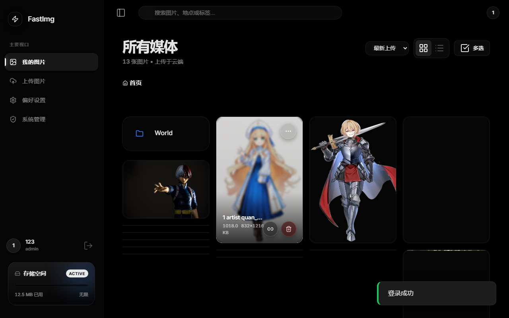
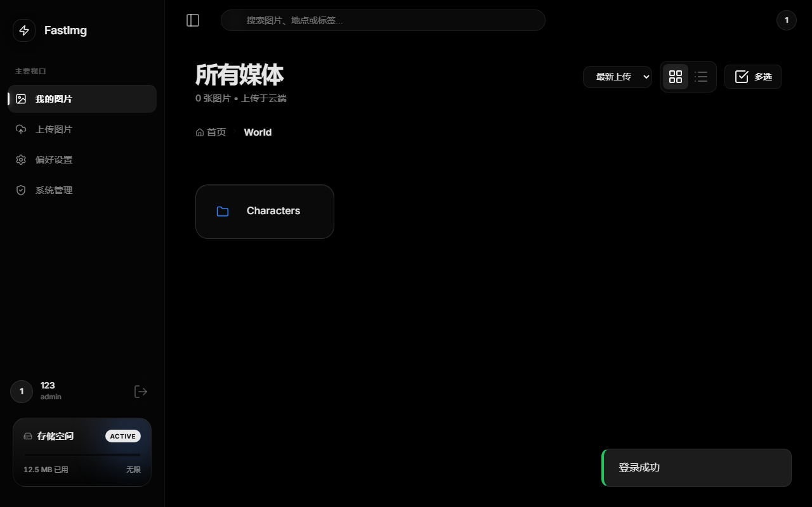
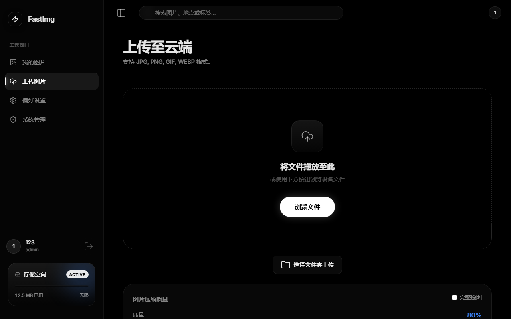
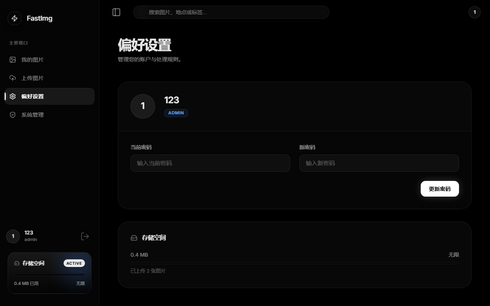

# ⚡ FastImg

一个轻量级、现代化、抗打击的图床应用，专为 VPS 部署设计。


<div align="center">
  
</div>

## ✨ 特性

- **现代化 UI / UX**:
  - 🎨 **极简设计**: 默认 Slate 灰，内置 Stone, Zinc, Light 等多款优雅主题。
  - 🖼️ **瀑布流与列表视图**: 丝滑的图片浏览体验，支持多种排序方式（时间、大小、名称）。
  - 📱 **完全响应式**: 完美适配桌面与移动端设备。

- **强大的 Upload 核心**:
  - 📤 **批量上传**: 支持多文件拖拽上传，带有实时进度队列。
  - 🖼️ **原图与透传模式**: 
      - **原图模式**：质量100%，保留EXIF旋转信息。
      - **完整原图（透传）**：完全保留原始文件字节，适合**酒馆角色卡**等带元数据的 PNG 图片。
  - 🎚️ **压缩控制**: 用户可自定义压缩质量（受管理员配额限制）。
  - 🛡️ **安全检测**: 基于文件头的格式检查 (Magic Bytes) 与解压炸弹防御。
  - 🔒 **CSRF 保护**: 全站 API 启用 CSRF 验证，保障安全。

- **精细化权限管理**:
  - 👥 **用户管理**: 管理员可查看、禁用、删除用户，修改用户角色。
  - 💾 **个人配额**: 支持为每个用户单独设置存储空间上限（支持无限制）。
  - 🔑 **邀请码机制**: 支持生成一次性或限次邀请码，控制注册用户。
  - ⚙️ **动态配置**: 实时调整全局上传限制、默认质量、水印等。
  - 🛡️ **安全防护**: 内置 Flask-Limiter 接口限流，自动移除 EXIF 隐私信息。

## 📸 界面预览

| 瀑布流图库 | 上传队列 |
|:---:|:---:|
|  |  |

| 管理配置 | 用户管理 |
|:---:|:---:|
|  |  |

## 🚀 快速开始

### 本地开发

```bash
# 1. 克隆项目
git clone https://github.com/your-username/image-host.git
cd image-host

# 2. 安装依赖
pip install -r requirements.txt

# 3. 启动应用
python app.py
```

访问 `http://localhost:5000`，第一个注册的用户自动成为管理员。

---

## 🐳 Docker 部署 (推荐)

### ⚡ 一键部署脚本

```bash
curl -sSL https://raw.githubusercontent.com/bwwq/fastimg/main/setup.sh | bash
```

### 方式一：Docker Compose手动

```bash
# 构建并启动
docker-compose up -d --build

# 查看日志
docker-compose logs -f
```

### 方式二：手动 Docker

```bash
# 构建镜像
docker build -t imghost .

# 启动容器
docker run -d \
  --name imghost \
  -p 5000:5000 \
  -v $(pwd)/uploads:/app/uploads \
  -v $(pwd)/data:/app/data \
  imghost
```

> **注意**：数据库文件现位于 `/app/data/database.db`，请务必挂载 `/app/data` 目录以持久化数据。

---

## 🌐 生产部署 + 反向代理

### 使用 Nginx 反向代理

1. **安装 Nginx**
   ```bash
   sudo apt update && sudo apt install nginx -y
   ```

2. **配置 Nginx** (`/etc/nginx/sites-available/imghost`)
   ```nginx
   server {
       listen 80;
       server_name your-domain.com;  # 替换为你的域名

       client_max_body_size 50M;  # 允许上传大文件

       location / {
           proxy_pass http://127.0.0.1:5000;
           proxy_set_header Host $host;
           proxy_set_header X-Real-IP $remote_addr;
           proxy_set_header X-Forwarded-For $proxy_add_x_forwarded_for;
           proxy_set_header X-Forwarded-Proto $scheme;
           proxy_set_header X-CSRFToken $http_x_csrf_token; # 传递 CSRF header
       }

       # 静态文件缓存优化
       location /i/ {
           proxy_pass http://127.0.0.1:5000;
           proxy_cache_valid 200 7d;
           add_header Cache-Control "public, max-age=604800";
       }
   }
   ```

3. **启用配置**
   ```bash
   sudo ln -s /etc/nginx/sites-available/imghost /etc/nginx/sites-enabled/
   sudo nginx -t
   sudo systemctl reload nginx
   ```

### 使用 Caddy (更简单，自动 HTTPS)

1. **安装 Caddy**
   ```bash
   sudo apt install -y debian-keyring debian-archive-keyring apt-transport-https
   curl -1sLf 'https://dl.cloudsmith.io/public/caddy/stable/gpg.key' | sudo gpg --dearmor -o /usr/share/keyrings/caddy-stable-archive-keyring.gpg
   curl -1sLf 'https://dl.cloudsmith.io/public/caddy/stable/debian.deb.txt' | sudo tee /etc/apt/sources.list.d/caddy-stable.list
   sudo apt update && sudo apt install caddy -y
   ```

2. **配置 Caddyfile** (`/etc/caddy/Caddyfile`)
   ```
   your-domain.com {
       reverse_proxy localhost:5000
   }
   ```

3. **重启 Caddy**
   ```bash
   sudo systemctl restart caddy
   ```

> Caddy 会自动申请并续期 Let's Encrypt SSL 证书！

---

## 🛠️ 管理员指南

- **成为管理员**: 系统**第一个注册**的用户将自动获得管理员权限。
- **管理面板**: 登录后点击侧边栏 "系统设置"。
- **功能**:
  | 标签页 | 功能 |
  |--------|------|
  | 系统配置 | 上传限制、压缩质量、WebP 转换、水印设置 |
  | 用户管理 | 查看用户文件、修改密码、设置**个人存储配额** |
  | 邀请码 | 生成/管理邀请码 |

---

## 📂 目录结构

```
.
├── app.py              # 后端核心逻辑
├── models.py           # 数据库模型
├── utils.py            # 图片处理与安全工具
├── config.py           # 配置文件
├── init_db.py          # 数据库初始化与迁移
├── extensions.py       # 扩展初始化
├── uploads/            # 图片存储目录 (需备份)
├── data/               # 数据目录 (需备份)
│   └── database.db     # SQLite 数据库
├── static/             # 前端资源
│   ├── css/            # 模块化样式 (base, components, layout, themes)
│   ├── js/             # 前端逻辑
│   └── index.html      # 单页应用入口
├── screenshots/        # 项目截图
├── Dockerfile          # Docker 镜像构建
└── docker-compose.yml  # 容器编排
```

---

## 🔧 环境变量

| 变量 | 说明 | 默认值 |
|------|------|--------|
| `SECRET_KEY` | Flask 密钥 | 自动生成 |
| `UPLOAD_FOLDER` | 图片存储路径 | `./uploads` |
| `DATABASE_URL` | 数据库连接串 | `sqlite:///data/database.db` |

---

## 📝 License

MIT
